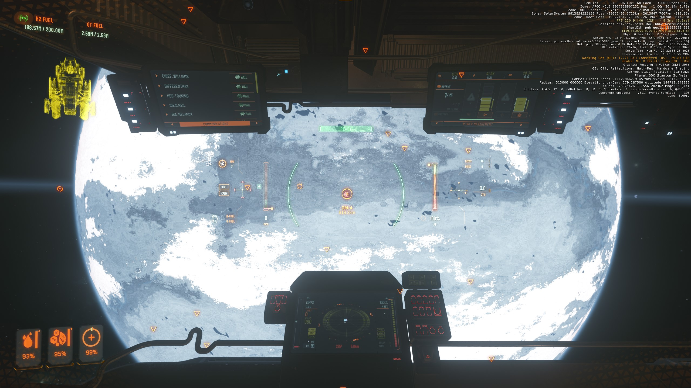

<!--
  README structure: landing page first (zero jargon), bleeds into technical
  detail as you scroll, opens into a curated deep-dive zone for devs and
  Star Citizen enthusiasts. Sections marked AUTO:<name> are regenerated by
  .github/workflows/update-stats.yml on every push. Edit
  scripts/update-readme-stats.ps1 for permanent changes to those.

  Tone: "fan project, engineering taken seriously". Honest about scope
  (single-dev hobby), proud of process (tests, signed artifacts, reproducible
  benchmarks). Long-term aspiration: rigorous enough that the SC dev team
  could read these docs and find something actionable.
-->

<div align="center">

# sc-agent

**A free Windows tool that shows you where you are — and where you're going — in Star Citizen.**

[](https://github.com/zimm1/sc-agent-public/releases/latest)
&nbsp;
[](LICENSE)
&nbsp;
[](#how-its-safe)
&nbsp;
[](https://github.com/zimm1/sc-agent-public/discussions)

<br>



*The in-game debug overlay (top-right corner) is what sc-agent reads. Save anywhere with `F7`. Cycle targets with `F8`. The bracket follows the planet.*

</div>

<br>

> **What this is, in one sentence:** a fan project, built by one person, that takes the engineering seriously — open data, signed artifacts, reproducible benchmarks, all the decisions documented. The end goal is for this to be the kind of resource the SC dev team themselves could read and find something useful in. **For now, it's a promising fan project, and that's already worth showing.**

## What it is

A small Windows app that reads the **debug overlay** Star Citizen already has built in (`r_DisplayInfo 3`) and turns it into a useful navigation tool: save Points of Interest in flight with a hotkey, see a screen-space arrow pointing at them, never lose that perfect cave entrance again.

It does **not** modify the game. It does **not** read game memory. It does **not** press keys for you. It just looks at the screen — the same way OBS, Discord, or screen recorders do. Easy Anti-Cheat is fine with it.

## Getting started — 3 minutes

1. **Download** the latest installer from [Releases](https://github.com/zimm1/sc-agent-public/releases/latest) — pick the file ending in `.msix`.
2. **Install** by double-clicking. Click *More info → Run anyway* if Windows shows a SmartScreen warning (normal for new apps).
3. **In Star Citizen**: press <kbd>~</kbd>, type `r_DisplayInfo 3`, hit Enter. Then press <kbd>F7</kbd> anywhere to save your spot.

That's it. The app lives in your tray (next to the clock) — right-click for **Library** and **Settings**.

➡️ **Long version**: [`docs/getting-started.md`](docs/getting-started.md) — friendly tour for users who have never installed an app from outside the Microsoft Store.

## How it works (short version)

A few cool things going on under the hood, in plain language:

🔬 **It learns to read the in-game overlay using a neural network**, not a regex. The model is a fine-tuned PP-OCRv4 (the same family Baidu ships in PaddleOCR) running on your GPU through DirectML — so it works on **any** modern AMD, Intel, or NVIDIA card, no CUDA install required. There's also a CPU fallback for older machines and a "max quality" tier for people with a recent NVIDIA GPU.

🛰️ **The math behind the bracket** is a 3D rotation problem. Star Citizen runs every body in its own rotating reference frame; sc-agent translates between body-local and system-level coordinates using rotation period + axis + phase. The first two come straight from the game files; the phase angle has to be measured live — and that's where the next bullet comes in.

🌍 **Rotation phase is community-calibrated.** Every time you sit still on a planet's surface, the app silently solves for the body's current rotational angle. After enough samples converge, it offers to **share that measurement** with everyone else (opt-in, manual review of the JSON before you submit). Your data ends up in [`phase/`](phase/) where the next person to fly there benefits.

🔐 **OCR models are signed.** The neural network files are fetched from this repo's Releases, and the manifest is verified against an Ed25519 signature embedded in the app. If somebody tampered with a model file or the manifest in transit, the app refuses to load it.

📡 **It's read-only on Star Citizen.** No DLL injection, no memory reads, no synthetic input — just Windows Graphics Capture (the same API OBS uses) reading pixels from a window the player explicitly opted into. See [How it's safe](#how-its-safe) below.

➡️ **The deep version**, with numbers and decisions: [Behind the scenes](#behind-the-scenes) further down.

## Cool numbers

<!-- AUTO:stats -->
<!-- This section is auto-generated by .github/workflows/update-stats.yml.
     Last update: never (workflow runs on first push to main). -->

| 📍 Universe data | 🤖 OCR models | 🪐 Rotation phase |
|---|---|---|
| _stats pending first workflow run_ | _stats pending first workflow run_ | _stats pending first workflow run_ |

<!-- /AUTO:stats -->

Reproducible OCR latency benchmarks across the four engine tiers (run on the maintainer's RTX 3080, Windows 10 22H2): see [`docs/dev/bench-numbers.md`](docs/dev/bench-numbers.md). Bench harness is in the private code repo, results published unedited.

## What's in here

| Folder / link | What's there | Who needs it |
|---|---|---|
| **[Releases](https://github.com/zimm1/sc-agent-public/releases)** | App installers, dataset bundles, OCR model bundles | Everyone — start here |
| [`universe/`](universe/) | Catalog of celestial bodies, stations, points of interest | Looking up coordinates, contributing POI fixes |
| [`models/`](models/) | OCR neural networks (signed manifest) | The app downloads these automatically; advanced users only |
| [`phase/`](phase/) | Per-body rotation phase angles, community-calibrated | Reference data; auto-fed back by the app over time |
| [`docs/`](docs/) | Reference docs (formats, signing, contributing) | Devs building tools that read this data |
| [`docs/dev/`](docs/dev/) | Deep-dive write-ups: decisions, war stories, bench numbers | The curious, tool authors, and one day hopefully CIG |
| **[Discussions](https://github.com/zimm1/sc-agent-public/discussions)** | Roadmap voting, ideas, Q&A, hype, finds | When you don't have a bug but you want to talk |
| **[Issues](https://github.com/zimm1/sc-agent-public/issues)** | Bug reports + concrete corrections | When something's not working |

## How it's safe

| Concern | Reality |
|---|---|
| Does it inject DLLs into Star Citizen? | No. |
| Does it read game memory? | No. |
| Does it hook game functions? | No. |
| Does it press keys / move the mouse for me? | No (forbidden by design — see [`docs/dev/eac-posture.md`](docs/dev/eac-posture.md)). |
| What does it do to read my position? | Reads the pixels of the in-game debug overlay you enabled with `r_DisplayInfo 3`. Same Windows API as OBS uses. |
| Does it phone home? | Only fetches public data from this repo's Releases. Phase contributions are opt-in, manual, and you preview the JSON before submitting. See [`docs/privacy.md`](docs/privacy.md). |

## Roadmap + feedback

This is a single-developer hobby project, but the engineering is taken seriously and most decisions are documented in [`docs/dev/decisions-log.md`](docs/dev/decisions-log.md). The roadmap lives in [Discussions → Ideas](https://github.com/zimm1/sc-agent-public/discussions/categories/ideas) — upvote what you'd like next, propose your own, or just lurk to see what's coming.

Currently in flight:
- 🚀 **v0.0.1** — first MSIX release with bracket overlay + hotkey-save POI + 4-tier OCR.
- 🛠️ **v0.0.2** — community phase calibration ships, T-1 NVIDIA tier with TensorRT INT8.
- 💡 **v0.0.3+** — pulled from whatever wins in [Discussions → Ideas](https://github.com/zimm1/sc-agent-public/discussions/categories/ideas).

Not on the roadmap, by design:
- ❌ Anything that presses keys / clicks for the player. sc-agent stays read-only — that's part of how it stays EAC-safe.
- ❌ Multi-account / shared cloud sync. Local app, local data.

If you have a fan-made tool that could share data formats with sc-agent (waypoint exchange, POI export, etc.), the formats in [`docs/data-format.md`](docs/data-format.md) are deliberately open and stable — feel free to consume them, no need to ask.

## Contributing

- **POI corrections** (wrong name, wrong coordinates): [open an issue](https://github.com/zimm1/sc-agent-public/issues/new) — there's a template.
- **Rotation phase data**: the app submits this for you (opt-in) once it has measured enough samples. See [`docs/phase-data.md`](docs/phase-data.md).
- **Ideas / questions / "did anyone notice X"**: [Discussions](https://github.com/zimm1/sc-agent-public/discussions) is the right place — Issues are reserved for actionable bug reports.
- **Bigger contribution / app source code**: see [`CONTRIBUTING.md`](CONTRIBUTING.md). The app source lives in a separate private repo today, but data + docs PRs land here directly.

## License + acknowledgments

- **Code, scripts, schemas**: MIT — [`LICENSE`](LICENSE).
- **Star Citizen** is © Cloud Imperium Games — used under the [fan content policy](https://cloudimperiumgames.com/policies/fan-content-policy). This project is not affiliated with or endorsed by CIG.
- **Rotation phase community values** initially seeded from [Valalol/Star-Citizen-Navigation](https://github.com/Valalol/Star-Citizen-Navigation) (MIT, ultimate origin: Murphy Exploration Group community measurements).
- Everyone who reported a bug, fixed a POI, contributed phase observations.

---

## Behind the scenes

Curated write-ups for the curious. Each one is the *real* story of a decision or a discovery — the trade-offs considered, the things that didn't work, the numbers that decided it. Published when the maintainer thinks they're worth sharing. **No NDA stuff, no proprietary internals** — just the engineering process, in the open.

> 🎯 **Long-term goal of this section**: be rigorous enough that an actual SC dev (or a serious tool author) could read it and find something actionable. We're not there yet — but every doc here is written with that bar in mind.

> 🟢 **Ready** = written long-form. 📝 **Outline** = stub with the gist + a pointer to where the answer lives today; full write-up is queued. The maintainer publishes long-forms when there's enough material to be worth reading, not before.

### Architecture + decisions

| | Topic | Read |
|---|---|---|
| 🟢 | **Decisions log** — plain-English summary of every architectural choice, with rationale and what was rejected | [`docs/dev/decisions-log.md`](docs/dev/decisions-log.md) |
| 📝 | **OCR tier ladder** — how the app picks an engine for your hardware (T-1 → T0 → T1 → T3 fallback) | [`docs/dev/ocr-tier-ladder.md`](docs/dev/ocr-tier-ladder.md) |
| 📝 | **Why DirectML and not CUDA** — cross-vendor GPU support, what it cost in latency, why it's worth it | [`docs/dev/why-directml.md`](docs/dev/why-directml.md) |
| 📝 | **Signed model manifest** — Ed25519 + JCS RFC 8785, single-key trust anchor, rotation policy | [`docs/dev/signed-manifest-design.md`](docs/dev/signed-manifest-design.md) |
| 📝 | **EAC posture** — why Windows Graphics Capture is fine, what's NOT fine and why we don't do it | [`docs/dev/eac-posture.md`](docs/dev/eac-posture.md) |

### War stories

| | Topic | Read |
|---|---|---|
| 🟢 | **The 5-year-old DirectML.dll trap** — HRESULT 887A0004 root cause, how System32's stale 2020 DLL ate two days of debugging | [`docs/dev/dml-system32-trap.md`](docs/dev/dml-system32-trap.md) |
| 📝 | **T-1 NVIDIA tier NO-GO** — why CUDA + TensorRT couldn't ship in v0.0.1 and the two-process design that fixes it in v0.0.2 | [`docs/dev/t-1-two-process.md`](docs/dev/t-1-two-process.md) |

### Star Citizen domain

| | Topic | Read |
|---|---|---|
| 🟢 | **SC's coordinate model** — body-fixed-rotating frames, why local coords don't change when you're stationary | [`docs/dev/sc-coordinate-model.md`](docs/dev/sc-coordinate-model.md) |
| 📝 | **Rotation phase, the only thing CIG doesn't ship** — what we extracted, what we couldn't, how the community fills the gap | [`docs/dev/rotation-phase-story.md`](docs/dev/rotation-phase-story.md) |
| 📝 | **How POIs get into the dataset** — Data.p4k → DataCore → schema, with `crc_soc` change detection | [`docs/dev/dataset-pipeline.md`](docs/dev/dataset-pipeline.md) |

### Numbers

| | Topic | Read |
|---|---|---|
| 📝 | **OCR latency benchmarks** — p50/p95/p99 per tier on reference hardware, reproducible | [`docs/dev/bench-numbers.md`](docs/dev/bench-numbers.md) |
| 📝 | **Test coverage + reliability** — what's tested, what isn't, why | [`docs/dev/test-coverage.md`](docs/dev/test-coverage.md) |

> 💬 Found something interesting? Disagree with a decision? Spot a math bug? Open a [Discussion](https://github.com/zimm1/sc-agent-public/discussions) — pulling back the curtain is half the fun, and being told you got something wrong is how it gets better.

---

<details>
<summary><b>For maintainers + tool authors</b> — operational + machine-readable surface</summary>

<br>

### Stable consumer URLs

```
# Latest dataset (auto-redirects to the most recent release):
https://github.com/zimm1/sc-agent-public/releases/download/dataset-latest/dataset.json

# Latest models manifest:
https://github.com/zimm1/sc-agent-public/releases/latest/download/models-manifest.json

# Versioned dataset (specific Star Citizen patch):
https://github.com/zimm1/sc-agent-public/releases/download/dataset-v<patch>/dataset.json
```

### Schemas

- [`docs/data-format.md`](docs/data-format.md) — universe dataset schema v=1, lookup patterns
- [`docs/models-distribution.md`](docs/models-distribution.md) — OCR model manifest schema v=2, Ed25519 signature verification, app fetch flow
- [`docs/phase-data.md`](docs/phase-data.md) — rotation phase per-body schema, calibration mechanism, submission flows
- [`docs/privacy.md`](docs/privacy.md) — full network-traffic disclosure

### Repo conventions

- **Branches**: `main` is the only long-lived branch. Releases go through `release/<track>-vX.Y.Z` PRs (see [`docs/release-process.md`](docs/release-process.md)). Doc/typo fixes can direct-push.
- **Commit style**: plain-English imperative ("Add Pyro outpost coordinates", "Fix Lorville landing pad name").
- **Reviews**: every PR gets at least one review before merge — currently the maintainer; the [reviewer model](docs/release-process.md#reviewer-model--where-this-is-going) is shaped to accept community / vote-based / ML-assisted reviewers without changing day-to-day mechanics.
- **Tags + Releases**: `dataset-v<sc-patch>`, `models-v<X.Y.Z>`, `app-v<X.Y.Z>`. Rolling tags `dataset-latest` + `models-latest` always point at the freshest version.
- **Auto-updating sections**: the README "Cool numbers" stats are regenerated by [`.github/workflows/update-stats.yml`](.github/workflows/update-stats.yml) on every push that touches `universe/`, `phase/`, or `models/`. Manual edits inside `<!-- AUTO:* -->` blocks are overwritten — change [`scripts/update-readme-stats.ps1`](scripts/update-readme-stats.ps1) for permanent edits.
- **CI**: every release PR triggers [`verify-manifest.yml`](.github/workflows/verify-manifest.yml), which validates model manifest signatures before allowing merge. Labels are kept in sync with [`.github/labels.yml`](.github/labels.yml) via [`labels.yml`](.github/workflows/labels.yml).
- **Release flow**: documented step-by-step in [`docs/release-process.md`](docs/release-process.md).
- **Sync flow** (private code repo → here): documented in [`docs/dev/sync-process.md`](docs/dev/sync-process.md).

### Status

<!-- AUTO:status -->
_Last data publish: pending first workflow run._
<!-- /AUTO:status -->

</details>
